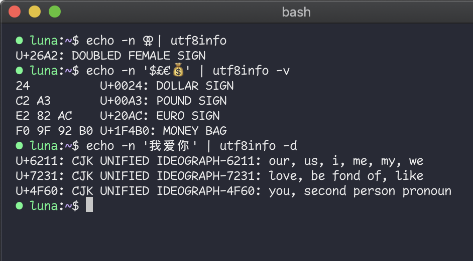

# utf8info


**utf8info** is a small utility that reads a UTF-8 stream and prints out the raw codepoint information. It's useful for spotting invisible control characters like U+202E "RIGHT-TO-LEFT OVERRIDE", and all of the different types of space (because there are [more than you might assume](https://www.cs.tut.fi/~jkorpela/chars/spaces.html)).



## Building & Installing

On macOS and Linux, it _should_ be as simple as running the following inside the `utf8info` directory:

```
make && make install
```

Windows is not _officially_ supported, but it'll likely work under WSL.

_Note: Building **utf8info** depends on `curl` and a C++17-compatible C++ compiler being present._

## Options:

```
-v, --verbose       Enable verbose output. This prints the raw UTF-8 bytes next to the codepoint info.
-d, --definitions   Display definitions for CJK Unified Ideographs
```
